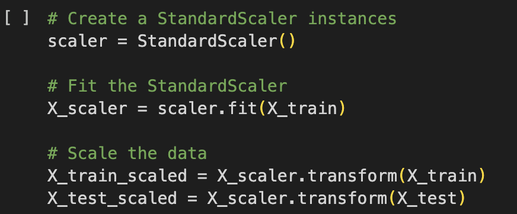
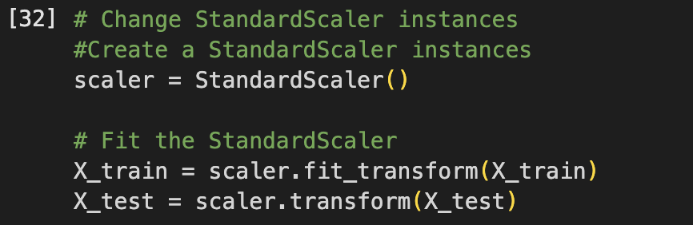

# deep-learning-challenge

# Alphabet Soup Deep Learning Model Performance Report
## Overview of the Analysis

The purpose of this analysis was to create a deep learning model capable of predicting whether an applicant funded by Alphabet Soup will be successful. By analyzing historical data, the model can help the nonprofit foundation make informed decisions on which organizations to fund, thereby optimizing resource allocation.

## Results

### Data Preprocessing

**1. Target Variable:**
- The target variable for the model is IS_SUCCESSFUL, which indicates whether the funding led to a successful outcome (1 for success, 0 for failure).

**2. Features:**
- The features used for the model include all columns except the target variable and unnecessary identification columns:
    - Examples: STATUS, ASK_AMT, APPLICATION_TYPE_T3, USE_CASE_ProductDev, and many others.
- Features were one-hot encoded to handle categorical variables and scaled using StandardScaler to normalize numerical values.

**3. Removed Variables:**

- EIN and NAME were removed because they are identifiers and not relevant to the model's prediction.

### Compiling, Training, and Evaluating the Model

**1. Model Architecture:**

- **Number of Layers:** 4 hidden layers.
- **Hidden Layer Neurons:**
    - Layer 1: 80 neurons, ReLU activation.
    - Layer 2: 30 neurons, ReLU activation.
    - Layer 3: 60 neurons, ReLU activation.
    - Layer 4: 40 neurons, ReLU activation.
      
- **Output Layer:** 1 neuron, sigmoid activation (for binary classification).
- This architecture was chosen to balance complexity with performance without overfitting.

**2. Training and Epochs:**

- The model was trained for 200 epochs, with a batch size of 32, using the Adam optimizer and binary_crossentropy as the loss function.
- Validation data was used to monitor model performance during training.

**3. Performance:**

- The best performance achieved was:
    - Loss: 0.5958
    - Accuracy: 72.49%
- While this is close to the earlier peak accuracy (72.69%), the increase in epochs and added complexity did not significantly improve performance.
  
**4. Optimization Attempts:**

- The feature scaling was updated to use a different format of StandardScaler, which improved accuracy from ~66% to ~72%.
  - **Default Feature Scaling** 
  - **Revised Feature Scaling**
  - **66% Accuracy**
  - **72% Accuracy**

- Different numbers of layers (2 to 4, then 4 vs. 6) were tested, and 4 layers performed slightly better overall.
- Increased epochs (up to 200) improved model stability but did not significantly enhance accuracy beyond ~72.5%.

## Summary

The deep learning model achieved a maximum accuracy of 72.49%, slightly below the target performance of 75%. Scaling the features significantly improved the model’s performance, demonstrating the importance of preprocessing in deep learning.

### Recommendations for Further Improvement:

**1. Alternative Models:**

- Consider using a Random Forest Classifier or Gradient Boosting model, which could perform better with structured tabular data.
- These other models can tackle small data imbalances and often require less tuning compared to neural networks.
  
**2. Feature Engineering:**

- Analyze and remove repetitive or less informative parts to reduce messiness.
- Analyze interactions between features to create new, meaningful variables.

## References 

ChatGPT and Xpert Learning Assistant were used for analysis reference and troubleshooting errors for this project assignment.

- OpenAI. (December, 2024). ChatGPT (GPT-4) [Large language model]. https://chat.openai.com/ Xpert Learning Assistant was used for troubleshooting errors for this project assignment.

- Xpert Learning Assistant. (2024). Retrieved from https://bootcampspot.instructure.com/
